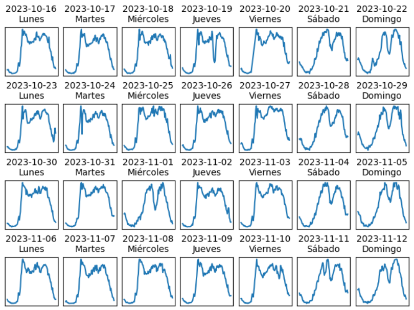
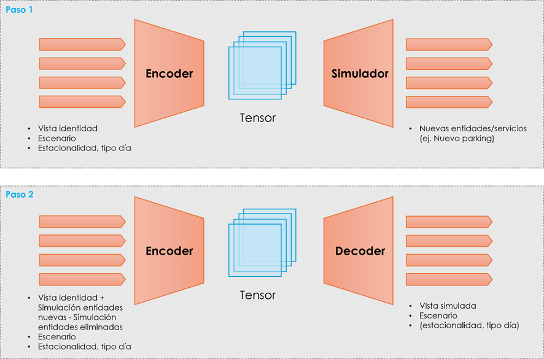

# Gemelo Digital

## Introducción

Este repositorio contiene los modelos, procesos y aplicaciones definidos para la creación de un gemelo digital de ciudad.

El concepto de "gemelo digital" se utiliza en múltiples contextos (industria, I+D, economía, modelado 3D, etc) y tiene muchísimas acepciones distintas. En este proyecto, nos referimos concretamente por *gemelo digital* a:

- Una **caracterización estadística** del comportamiento los servicios públicos o métricas de una ciudad (ejemplos: intensidad del tráfico, probabilidad de congestión de las principales vías, etc), que proporciona información sobre los patrones habituales que sigue dicho servicio en diferentes momentos o diferentes zonas de la ciudad. A esta caracterización la denominamos **identidad** de la ciudad.

- Un **modelo matemático** que predice cambios en dicha caracterización, a largo plazo, como consecuencia de modificaciones urbanísticas, regulatorias, etc. Este modelo utiliza un conjunto de supuestos (**escenarios**) para calcular variaciones en la caracterización de la ciudad (**simulación**).

## Manual de usuario

El uso de la vertical se describe en el [Manual de Usuario](./usuario/README.md)

## Datasets

Tanto el análisis estadístico como el aprendizaje predictivo que se realizan en este proyecto se basan en el procesamiento de **datasets** con información histórica de las métricas o servicios soportados. Cada dataset consiste en un **conjunto de series temporales históricas, monovariables y georeferenciadas**, asociadas cada una a un punto de medida. Cada elemento de cada dataset proporciona:

- Un identificador del elemento de medida.
- Una fecha de la medida.
- El valor de la medida.
- Una codificación geográfica del elemento de medida (coordenadas o ID de zona).
- Otras características relevantes del punto de medida, dependiendo del dataset concreto. Ver la descripción de los datasets más adelante.

Los modelos y procedimientos que se definen en este proyecto son aplicables a cualquier ciudad que pueda proporcionar datasets equivalentes a los definidos en esta documentación. 
Todos los datasets que se han usado en este proyecto se basan en el análisis de información real disponible en un caso práctico de cliente de la plataforma Thinking Cities de Telefónica.

Los detalles de los datasets soportados se proporcionan en los siguientes documentos:

- [Dataset de aparcamientos](datasets/OffStreetParking.md)
- [Dataset de intensidad de tráfico](datasets/TrafficIntensity.md)
- [Dataset de congestión de tráfico](datasets/TrafficCongestion.md)
- [Dataset de frecuencia de paso de rutas](datasets/RouteSchedule.md)
- [Dataset de uso de rutas](datasets/RouteIntensity.md)

## Clasificación

El concepto de gemelo que se utiliza en este proyecto se basa en la presunción de que los datos de cada uno de los datasets anteriores se ajustan a un número finito de **patrones**, que se repiten en el tiempo.

Por ejemplo, si exceptuamos circunstancias especiales como festivos, se asume que las métricas de un cierto tramo de carretera se parecerán mucho de una semana a la siguiente. El tráfico de un martes normal debería parecerse razonablemente al del martes anterior, o al del miércoles siguiente. Pero puede ser sustancialmente distinto al de un domingo.

También es posible esperar cierta estacionalidad anual en las métricas. Por ejemplo, el tráfico de un lunes típico de invierno puede ser más denso que el de uno de verano, si los ciudadanos tienden a usar más el transporte privado con el mal tiempo.

El objetivo de la primera parte del gemelo, la **caracterización estadística**, es determinar estos patrones:

- Identificar los distintos patrones en régimen permanente que se deducen de las medidas obtenidas de la ciudad.
- Representar de manera visual cuál es el comportamiento de la ciudad en esas situaciones.

### Regularización de datasets

Las medidas obtenidas de los datasets originales tienen fechas que no son consistentes para distintos puntos de medida, o días. Es decir, las fechas en las que se producen las medidas no coinciden para puntos de medida distintos, ni están espaciadas entre sí de manera perfecta, ni las horas coinciden necesariamente de un día al siguiente.

Para poder comparar los datasets entre sí, a lo largo de diferentes días y entre diferentes puntos de medida, es necesario **regularizarlos** previamente.

La regularización consiste en garantizar que cada dataset tiene el mismo número de muestras por cada punto de medida y día, y que las fechas de esas muestras están espaciadas de manera regular y coinciden de un día para otro.

Esta regularización se hace mediante un resampling de las series temporales a intervalos fijos, típicamente de **10 minutos**. Aunque los métodos de resampling de cada dataset pueden tener variaciones en función de las características del mismo. Para más detalles, consultar la documentación de cada dataset.

### Tipos de día

El primer criterio de clasificación es el **tipo de día**. Cada uno de los datasets que se utiliza en el proyecto es una serie temporal univariable. Si se representan para cada dataset regularizado varios días consecutivos en un mismo punto de medida, se observarán grupos de días que se parecen entre sí.

El objetivo de la clasificación es identificar estos patrones. Formalmente,

- Se normalizan las series temporales regularizadas, restando y escalando cada serie por el valor medio de los últimos 30 días, para minimizar los efectos de la estacionalidad al compararlas entre sí a lo largo del año.

- Se aplica el algoritmo [Time Series Clustering mediante K-means](https://www.kaggle.com/code/izzettunc/introduction-to-time-series-clustering) sobre las series temporales regularizadas de cada punto de medida, para dividirlas en un número fijo de clusters `N_CLUSTERS`, dado como parámetro.

- Se descartan en cada cluster las series temporales que sean "outliers", considerando como outlier toda serie cuya distancia a la línea de centro de su cluster sea superior al percentil 90% de las distancias.

- Se observan las fechas que forman parte de cada grupo, para identificar relaciones de calendario entre las fechas que forman cada grupo.

Del análisis realizado en el caso práctico, se ha encontrado que la inmensa mayoría de los puntos de medida de todos los datasets se adaptan a una clasificación en cuatro tipos de día:

- Lunes a Jueves
- Viernes
- Sábado
- Domingo

Durante el análisis del caso práctico concluimos que esta clasificación es lo que tiene más sentido y sería aplicable a cualquier otro proyecto de ciudad, sin necesidad de repetir el análisis.

### Estacionalidad

El segundo criterio de clasificación es la estacionalidad. Si se cacula para cada dataset regularizado el valor medio mensual y su varianza. Los valores medios se pueden alinear en una matriz que indique cuánto se diferencia porcentualmente un mes de otro.

Estableciendo un umbral límite para la variación porcentual, se pueden distinguir grupos de meses que se mantienen dentro de los umbrales cuando se comparan entre sí, pero los exceden al compararse con otros.

Estos grupos se usan como criterio para discriminar por estacionalidad. Típicamente se esperan al menos dos estacionalidades distintas:

- Julio y Agosto
- Resto del año

Aunque en cada ciudad puede variar, por ejemplo: en una ciudad con estaciones de esquí importantes, Diciembre, Enero y Febrero pueden formar otro grupo de estacionalidad.

## Simulación

La aplicación que realiza las simulaciones está desarrollada siguiendo una estructura inspirada en un autoencoder, con dos bloques:

- El encoder recibe la información de la vista identidad y genera un vector que representa el estado de la ciudad. El proceso de encoding se repite para cada uno de los escenarios de la simulación (Estacionalidad y tipo de día), por ejemplo: el vector de los días laborables en temporada baja, el vector de los sábados en temporada alta, etc.

- El decoder sintetiza a partir del estado anterior, las métricas de cada uno de los servicios modelados por el gemelo (parking, tráfico, rutas, etc) en el escenario correspondiente

El proceso de simulación se efectúa en dos pasos:

- El primer paso reemplaza el encoder por un simulador que genera los resultados para los nuevos servicios que forman parte de la simulación. Por ejemplo, cuando una simulación añade un parking, o una ruta de transporte, el simulador genera a partir del estado devuelto por el encoder, una estimación del comportamiento que tendrá el nuevo servicio en los distintos escenarios. Actualmente, esta estimación es en la mayoría de los casos una media de los comportamientos aprendidos de otros servicios equivalentes, ponderada por la distancia y el bias configurado en la simulación.

- El segundo paso consiste en actualizar el estado considerando los resultados de la simulación anterior, y opcionalmente (si la simulación elimina servicios, como tramos de carretera), actualizando el estado para reflejar la desaparición de las medidas correspondientes a los elementos eliminados en la simulación, lo que genera un nuevo estado estimado que se procesa mediante el encoder original. De esta forma se calcula el impacto de los cambios simulados, en el resto de servicios de la ciudad.
