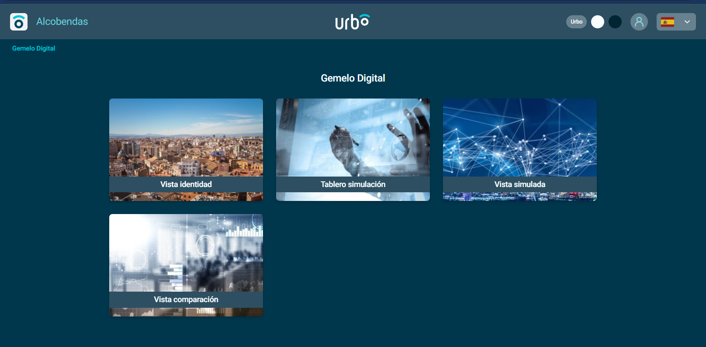
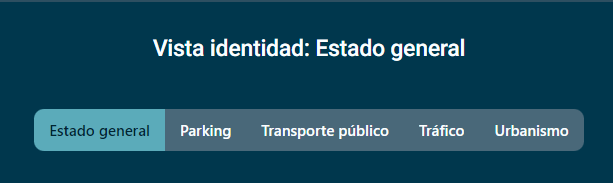

# Manual de usuario

La vertical del gemelo digital está compuesta de las siguientes vistas principales:

- [Vista identidad](#vista-identidad): La vista identidad es aquel conjunto de indicadores que mejor caracterizan una ciudad dentro del ámbito de estudio y para el punto de vista de un gestor. Es una vista real, no simulada, pero nueva, diseñada y optimizada para ser la mejor representación de la ciudad, el escenario cero, de referencia. Es el punto de partida del gemelo, ya que determina los conjuntos y modelos de datos que se utilizarán para generar las vistas simuladas.
- [Tablero de simulación](#tablero-de-simulación): El tablero de simulación permite la generación de nuevos escenarios, comprendidos dentros de los tipos de simulaciones establecidos actualmente: creación de un nuevo parking, creación de una nueva línea EMT, peatonalización de una calle y corte de una calle de larga duración.
- [Vista simulada](#vista-simulada): Como en la vista de identidad, los widgets de cada una de las pestañas que la componen permiten visualizar rápidamente el estado habitual de los servicios de la ciudad, pero con la diferencia de que estos paneles cuentan con un selector que permite elegir alguna de las simulaciones creadas anteriormente y, por tanto, reflejar también las perturbaciones modeladas por estas.
- [Vista comparación](#vista-comparación): Esta vista consta únicamente de un panel que permite realizar comparaciones en tiempo real entre las simulaciones creadas con anterioridad, así como el escenario por defecto: "la vista identidad".

### Navegación entre paneles

Una vez se ha accedido al entorno, la primera interfaz que se muestra es la de selección de ámbitos o scopes (las 4 vistas), como se corresponde con la siguiente imagen:

Después de seleccionar uno de los ámbitos, es posible navegar entre aquellos paneles que están relacionados con el mismo scope. Para ello, se dispone de dos opciones: 

- La primera es la navegación directa a través de las pestañas o "tabs":

- La otra posibilidad es clicar en la sección "ir al panel" y desplegar las opciones correspondientes. 

Para elegir otro ámbito, basta con retornar al menú incial a través de la barra del menú lateral, clicando en "selector de ámbitos".

Por último, también se puede utilizar la función de búsqueda con el icono de la lupa para dirigirse directamente al panel deseado dentro de un ámbito.

## Vista identidad

 La vista identidad es la vista resultante del proceso de caracterización de los conjuntos de datos más relevantes de una ciudad. Ese proceso de caracterización permite generar un modelo de referencia de la ciudad (gemelo) sobre el que poder aplicar simulaciones de nuevos escenarios (perturbaciones del modelo de referencia).​

 La vista identidad se materializa para el usuario en un conjunto de indicadores que muestran el comportamiento real de la ciudad de una forma “atemporal”, basada en patrones de comportamiento. En lugar de fechas concretas se muestran días “tipo” que permiten mostrar cómo se espera que se comporte la ciudad en ese tipo de día. 
 
 Es el panel considerado como inicial, y se divide en cinco secciones o pestañas:

- Estado general
- Parking
- Transporte público
- Tráfico
- Urbanismo

Cada una de ellas refleja una serie de widgets que permiten visualizar rápidamente el estado habitual de los servicios de la ciudad. En el caso concreto de la pestaña "estado general", sirve como punto de partida y resumen general de las demás pestañas.

En cuanto a los selectores que permiten filtrar o visualizar periodos o rangos concretos, serían los siguientes:

- Selector de temporada. Permite elegir entre las dos temporadas definidas actualmente: alta y baja.
- Selector de distrito. Posibilita seleccionar uno o varios entre los 19 distritos de la ciudad de Valencia para que los widgets que soporten filtrado, se actualicen con los datos correspondiente.
- Selector de tipo de día. Gracias al análisis del Big Data de Valencia, se han detectado patrones correspondientes específicamente a determinados días de la semana, por lo que se ha proporcionado al usuario la posibilidad de elegir cada uno de ellos.

Por otra parte, todos los paneles de este ámbito están siempre compuestos por un mapa con el estado esperado de los servicios, así como una serie de widgets.

El mapa muestra el estado de los 3 servicios definidos, con los datos correspondientes a la selección que se realice entre las temporadas, distritos y tipos de día. Por defecto, se visualizan todos los distritos en temporada baja y día laborable.
En las pestañas de parking, transporte público y tráfico, este mismo mapa sirve también para realizar una selección manual de los aparcamientos, líneas de EMT o tramos de tráfico concretos sobre los que se desee conocer los datos. Simplemente se debe clicar sobre uno de ellos y los datos se filtran automáticamente (siendo específicos estos filtros a cada una de las pestañas correspondientes):

Finalmente, para mejorar la experiencia del usuario, se  ha habilitado la selección y deselección de capas o servicios a trabés de la leyenda, mediante click.

Tanto este mapa como cada uno de los demás widgets cuentan con información detallada de la naturaleza de los datos y los filtros que soportan, disponible a través de los botones situados en la esquina inferior derecha.

## Tablero de simulación

 Es el siguiente paso lógico en el recorrido del usuario.
 Se divide en cuatro pestañas, que se corresponden con los cuatro escenarios contemplados:

- Nuevo parking
- Nueva línea EMT
- Peatonalización de calle
- Corte de calle de larga duración

Cada uno de ellos tiene un modo preestablecido para la generación de nuevas simulaciones que se ha definido en base a las características del tipo de simulación y a las capacidades de Urbo. Por ejemplo, en la primera pestaña, correspondiente al panel de creación del escenario "nuevo parking", la acción inicial que el usuario debe realizar será un click en el mapa (1), y a continuación, deberá comenzar a rellenar los datos del formulario emplazado a la izquierda (2):

Se ha provisto tanto una serie de mensajes por defecto para guiar al usuario (tooltips) en el proceso, como unas descripciones detalladas con la información necesaria. 

En cuanto al formato del formulario en sí, se han parametrizado los valores posibles para que el formato resultante pueda ofrecer un resultado acorde al input que el generador de escenarios espera.

En último lugar, en la parte inferior de todos los paneles de la vista del tablero de simulación, se muestra una sección dedicada a la consulta del histórico de las simulaciones guardadas.
El recorrido es similar al que se ha definido para las generaciones, y se ha tratado de facilitar al máximo la fluidez de la consulta de datos.

**NOTA**: No es posible editar una simulación ya guardada, solamente se permite el borrado. En el caso de que se desee cambiar alguno de los datos introducidos, es necesario generar una nueva simulación.

## Vista simulada

 Es una vista virtual, simulada, que resulta de aplicar escenarios de simulación sobre el gemelo digital de la ciudad y que permite al gestor analizar cómo cambiaría la ciudad si sucedieran las hipótesis aplicadas en el escenario simulado.
 Esta vista se consigue aplicando perturbaciones sobre la vista identidad y muestra cómo podrían modificarse los indicadores que definen el comportamiento de la ciudad si sucediera el caso planteado en la simulación.​
  
 Se divide en cinco secciones o pestañas:

- Estado general
- Parking
- Transporte público
- Tráfico
- Urbanismo

Como en la vista de identidad, cada una de ellas refleja una serie de widgets que permiten visualizar rápidamente el estado habitual de los servicios de la ciudad, pero con la diferencia de que estos paneles cuentan con un selector que permite elegir alguna de las simulaciones creadas anteriormente. También se han habilitado los selectores de temporada, tipo día y distrito, del mismo modo que en la vista de identidad.

Una vez elegida una simulación, los datos que se muestran en los widgets a continuación se corresponden con la perturbación provocada por los parámetros definidos en la simulación. 

## Vista comparación

En último lugar, esta vista consta únicamente de un panel que permite realizar comparaciones en tiempo real entre las simulaciones creadas con anterioridad, así como el escenario por defecto o "vista identidad".

El panel se ha dividido en 4 columnas, de forma que los widgets correspondientes a las dos de la izquierda formarían un bloque. Y sucede lo mismo con los de la derecha. El código de colores utilizado también sirve de apoyo para la diferenciación.

